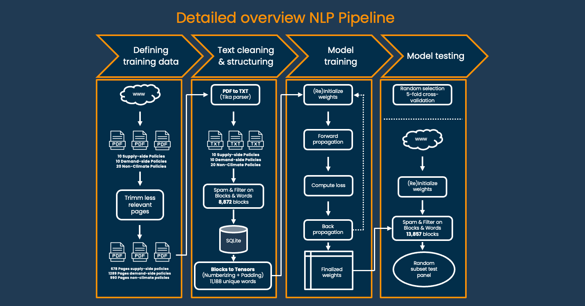
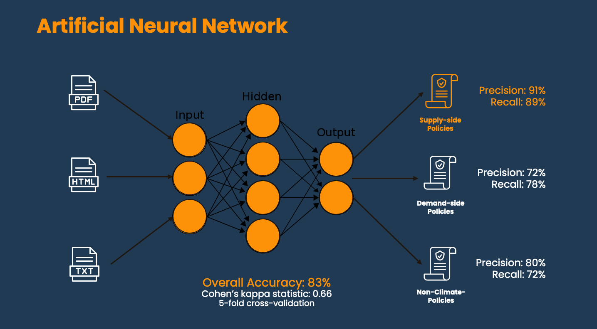

# Natural Language Processing for climate change policy classification

As part of the [Fossil Fuel Policy Tracking App](https://fossilfueltracker.org), I used Natural Language Processing to classify specific policy text data. Understanding how supply-side fossil fuel policies develop across countries is critical to ensure timely and effective climate actions across multiple levels and scales. Studying climate change supply-side fossil fuel policies has become increasingly difficult, particularly given the increasing volume of potentially relevant data available, the validity of existing methods handling large volumes of data, and comprehensiveness of assessing ongoing developments over time. In this project, I utilized machine learning to assist the FFNPT Initiative, collaborators, and researchers when conducting policy research using text as data. Specifically, I trained an Artificial Neural Network model to classify policy texts using data from various sources such as news-articles and official government databases. The main goal of this model is to take text data as input and be able to produce a label to classify these as ‘Supply-side related’, ’Demand-side related’, or ‘Non-climate policies’ with a certain probability. Having such an automated classification model saves a significant amount of time and resources and allows for a real-time tracking of fossil-fuel policy developments.

This repository contains all the software for running the NLP pipeline including some sample documents. It can be executed online as a binder notebook, simply from your browser by clicking this button .

Due to its size, the full dataset has been made available separately via Zenodo, [here](https://github.com/FUenal/fossil_fuel_policy_nlp). The software comes with a subset of the full dataset, and can be demonstrated without any additional changes. 

The Figure below gives an abstract overview of the NLP Pipepline.

The Figure below gives a more detailed overview of the NLP Pipepline.

The graphic below shows the overall model performance. 

 

## Notes
Do not change the names of any folders or files before finishing the pipeline, as the scripts look in folders with these specific names.

Step 1:  

In the folder 'PDF_files' the following PDF documents are contained.  
'Mitigation policy documents' - Training data for supply-side fossil fuel policies  
'Adaptation policy documents' - Training data for climate change adaptation and mitigation policies  
'Non-climate policy documents' - Training data for non-climate policies  
'Mixed policy documents' - Testing data, any PDF document(s) you want to predict on.  

Step 2:  
In the folder 'Python Scripts' every script in the pipeline is contained.  

### Main pipeline  
`pdf_parser.py` - Extract raw text from PDf documents (parsed_files)  
`text_cleanup.py` - Filters, cleansand structurizes data into 'bags-of-words' (structured_files)  
`sqlite_db.py` - Builds database and inserts cleaned data (climate.db)  
`numberizer.py` - Builds vocabulary from training data (conversion_dictionary.txt)  
`TF_classification_BW.py` - Builds neural network and stores it (tensorflow/logdir)  
`TF_classification_predict.py` - Uses stored model to predict on new data. Results stored in database.  

### Optional scripts   
`blocklength_dist.py` - Plots distribution of block lengths (Plots)  
`document_prediction.py` - Plots histogram of test set blocks and their labels. WARNING: Only use few documents  
`confidence_analysis.py` - Visualization for fraction of high confidence blocks  
`tensorboard_launch.py` - Launch tensorboard from stored model  

## Source
Source code adapted from: R. Biesbroek, S. Badloe, I. N. Athanasiadis, Machine learning for research on climate change adaptation policy integration: an exploratory UK case study, Regional Environmental Change, 20:85, 2020

